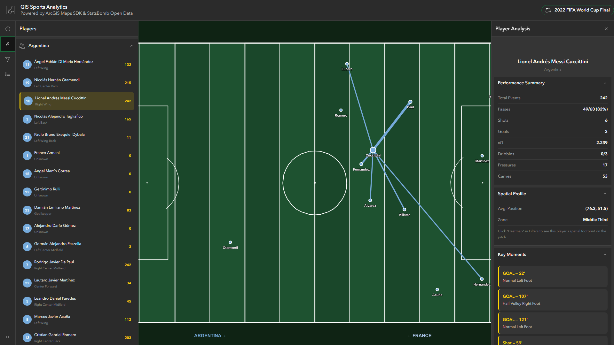

# GIS Sports Analytics — 2022 World Cup Final

An interactive ArcGIS JavaScript application that showcases the power of Geographic Information Systems (GIS) for sports analytics. The app maps every player action from the **2022 FIFA World Cup Final** (Argentina 3-3 France, Argentina wins 4-2 on penalties) using real match data from [StatsBomb Open Data](https://github.com/statsbomb/open-data).

All spatial analytics are powered by **Esri-native APIs** — `geometryEngine`, `HeatmapRenderer`, and `FeatureLayer.featureReduction` — for GPU-accelerated, production-grade performance.



## Live Demo

**[Launch the App](https://garridolecca.github.io/soccer-gis-analytics/)**

## Features

### 4 Visualization Modes
- **Events View** — Every pass, shot, dribble, tackle, and carry plotted on the pitch with color-coded markers and trajectory lines
- **Heatmap** — GPU-accelerated `HeatmapRenderer` on a `FeatureLayer` revealing event density, filterable by team, player, event type, and time
- **Pass Network** — Average player positions connected by pass frequency lines (thicker = more passes between players)
- **Shot Map** — All shots with xG (Expected Goals) data; goals highlighted as diamonds with trajectory lines

### Esri-Native Spatial Analytics
| Analytics | Esri API | Description |
|---|---|---|
| **Voronoi Tessellation** | `geometryEngine.convexHull()` + `geometryEngine.intersect()` | Territorial control zones clipped to pitch bounds |
| **Convex Hull** | `geometryEngine.convexHull()` on `Multipoint` | Team compactness and formation shape |
| **Area Measurement** | `geometryEngine.planarArea()` | Precise hull area in spatial units |
| **Pressure Zones (KDE)** | `FeatureLayer` + `HeatmapRenderer` | GPU-accelerated defensive pressure heatmap |
| **Event Clustering** | `FeatureLayer` + `featureReduction` (cluster) | GPU-accelerated spatial clustering with labels |
| **Directional Flow** | Custom zone aggregation | Aggregate passing vectors per pitch zone |

### Interactive Controls
- **Team Filter** — Isolate Argentina, France, or view both
- **Event Type Toggles** — Show/hide passes, shots, dribbles, tackles, carries
- **Time Slider** — Scrub through match minutes 0-125 to analyze phases of play
- **Player Selection** — Click any player to isolate their events and view detailed performance stats

### FeatureLayer Filtering
All `FeatureLayer`-based analytics (heatmap, pressure zones, clusters) use `definitionExpression` for native attribute-based filtering — no JavaScript re-rendering needed when changing team, player, event type, or time filters.

### Key Insights Panel
- Possession analysis based on pass volume
- Expected Goals (xG) comparison
- Pressing intensity analysis
- Auto-generated tactical insights from spatial data

### Player Analysis Panel
- Per-player stats: pass accuracy, shots, goals, xG, dribble success rate, pressures, carries
- Spatial profile: average position coordinates and pitch zone classification
- Key moments: goals and notable shots with timestamps

## Technology Stack

| Technology | Purpose |
|---|---|
| [ArcGIS Maps SDK for JavaScript 4.32](https://developers.arcgis.com/javascript/) | Map rendering, `geometryEngine`, `HeatmapRenderer`, `FeatureLayer`, popups |
| [Calcite Design System](https://developers.arcgis.com/calcite-design-system/) | UI shell, panels, filters, action bars, sliders |
| [StatsBomb Open Data](https://github.com/statsbomb/open-data) | Real match event data (CC BY-NC-SA 4.0) |

### Esri APIs Used
- `geometryEngine.convexHull()` — Native convex hull computation (C++ engine)
- `geometryEngine.intersect()` — Geometry clipping to pitch bounds
- `geometryEngine.planarArea()` — Area measurement
- `HeatmapRenderer` — GPU-accelerated kernel density rendering
- `FeatureLayer` (client-side source) — Attribute-based filtering via `definitionExpression`
- `FeatureLayer.featureReduction` — GPU-accelerated spatial clustering

## How GIS Powers Sports Analytics

This application demonstrates several core GIS concepts applied to sports:

- **Spatial visualization** — Converting raw x/y event coordinates into meaningful map layers on a standardized 120x80 pitch grid
- **GPU-accelerated heatmaps** — `HeatmapRenderer` for real-time density surfaces without manual KDE computation
- **Native geometry operations** — `geometryEngine` for convex hulls, intersection, and area — running in Esri's optimized C++ engine
- **Spatial clustering** — `featureReduction` for GPU-accelerated event grouping without custom DBSCAN
- **Network analysis** — Pass networks as spatial graphs showing tactical connections between players
- **Temporal analysis** — Time-slider filtering to analyze how spatial patterns evolve across match phases
- **Attribute-based filtering** — `definitionExpression` for instant filtering without re-rendering

## Data Source

**StatsBomb Open Data** — Match ID `3869685`
- ~3,000+ events with x/y pitch coordinates
- Event types: Pass, Shot, Carry, Dribble, Pressure, Tackle, Block, Interception, Ball Recovery
- Shot-level xG (Expected Goals) values
- Pass outcomes, recipients, and end locations
- Licensed under CC BY-NC-SA 4.0

## Getting Started

No build step required — this is a single HTML file that runs entirely in the browser.

1. Clone the repository:
   ```bash
   git clone https://github.com/garridolecca/soccer-gis-analytics.git
   ```
2. Open `index.html` in a modern browser
3. The app fetches match data from GitHub on load (requires internet connection)

## Match Highlights in the Data

| Minute | Event | Player |
|--------|-------|--------|
| 23' | Penalty Goal | Lionel Messi |
| 36' | Goal | Angel Di Maria |
| 80' | Goal | Kylian Mbappe |
| 81' | Goal | Kylian Mbappe |
| 108' | Goal | Lionel Messi |
| 118' | Goal | Kylian Mbappe |

## License

This project is open source. The match data is provided by StatsBomb under [CC BY-NC-SA 4.0](https://creativecommons.org/licenses/by-nc-sa/4.0/).
